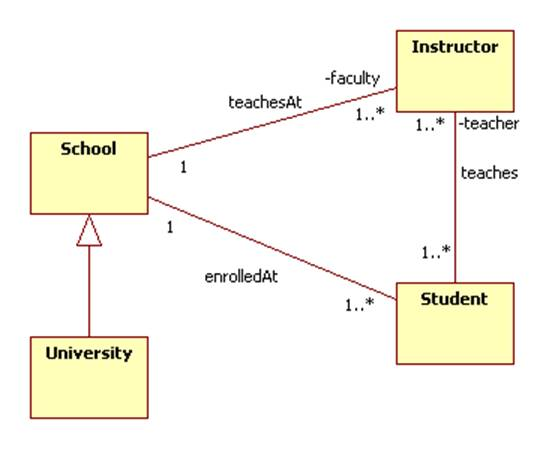

# Software Specification and Designed pattern

## Software Process

[See Software Process folder](https://github.com/thitgorn/SSD-midterm-preparation/tree/master/SoftwareProcess)

## Designed Pattern

- Observer
- Singleton
- Flyweight

  - load everything first then user call it later (no new creation)

- Composite

[UML diagram of these designed pattern](https://github.com/thitgorn/SSD-midterm-preparation/tree/master/DesignPattern)

## FURPS

- "**F**"unctional
  - Describe what the system can do
  - eg, Users "can" register/login to the system

- "**U**"sability
  - Understandability, Learnability, Operability, Attractiveness
  - eg, The text must be visible from 2 meters.
  - eg, All error messages in the system describe how to fix it.

- "**R**"eliability
  - Frequency of failure, Recoverability, Predictability.
  - eg, The system will fail less than 3 hours a week.
  - eg, The system can boot up after 1 minutes after failure

- "**P**"erformance
  - Response times, Throughput, Accuracy
  - eg, The system can handle up to 10k concurrent users
  - eg, The new feed calculation is always done with in 31.5 seconds

- "**S**"upportability
  - Adaptability, Maintainability, Internationalization
  - eg, The app supports Thai and English

## GRASP

- **Controller**
  - **Problem**: What first object beyond the UI layer receives and coordinates a system operation?
  - **Solution**: Assign the responsibility to:
    - The object that represents the overall system
    - The object that represents that particular use case

- **Creator**
  - **Problem**: Who creates an A?
  - **Solution**: Assign class B the responsibility to create an instance of class A if one of these is true (the more the better)
    - B contains A
    - B records A
    - B closely uses A
    - B has the initializing data for A

- **Information Experts**
  - **Problem**: What is a basic principle by which to assign responsibilities
  - **Solution**: Assign a responsibility to the class that has the information needed to fulfill it

- **High Cohesions**
  - **Problem**: How to keep objects focused, understandable, and manageable?
  - **Solution**: Assign the responsibility so that cohesion remains high. Use this to evaluate alternatives.

- Low Coupling
- Polymorphism
- Protected Variations
- Pure Fabrication
- Indirection

## Use case

- what are the step that user do to use our system.

  - example

    - Player start the game
    - Player roll the dice
    - If dice face more than 3 , player win

## Domain model

- find noun
- use noun try to create the relation between them

example 

## UML Class Diagram

- try to fill attribute and method from Domain model

some of notation

Inheritance

- extends

Dependency

- Do some thing in method

Aggregation

- aggregation (City, Tree, Car) "sub objects" (Tree, Car) will NOT be destroyed when City is destroyed.

Containment

- composition (Person, Heart, Hand), "sub objects" (Heart, Hand) will be destroyed as soon as Person is destroyed.

Association

- have attribute of

Directed Association

- Player have weapon

Realization

- Implements

## Sequence Diagram

- diagram that show timeline of each code

some of notation

[**See at SequenceDiagram.pdf**](https://github.com/thitgorn/SSD-midterm-preparation/blob/master/SequenceDiagram.pdf)

## Review OOP

- Different types of classes in Java Objects and there default methods
- Inheritance

  - Extends ( child class get their super methods )

- Interface

  - Implements something

- Common classes in Java such as List, Set, Map

  - List<int> i = new ArrayList&lt;&gt;();</int>

  - Set setA = new HashSet();
  - Map

    <key,value> map = new HashMap&lt;&gt;();</key,value>
